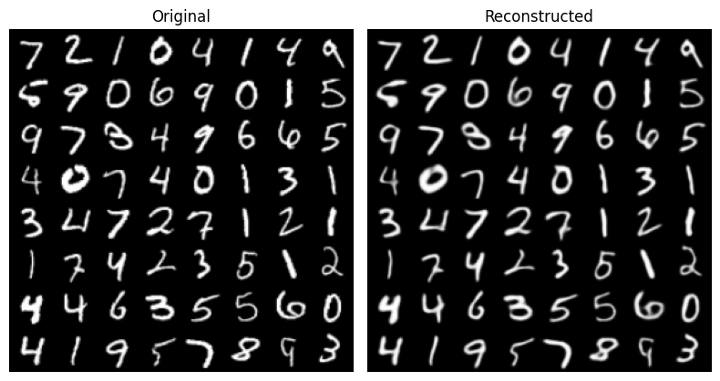
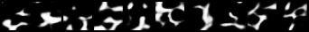
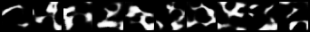
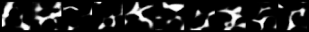

# DigitDreamer

**DigitDreamer** is a rectified flow Latent Diffusion Model (LDM) designed for generating MNIST digits with high fidelity. The project combines an F-16 autoencoder (non-KL) with a DiT diffusion model, leveraging a GAN loss during autoencoder training to improve reconstruction quality.

## Model Overview

DigitDreamer consists of two main components:

1. **Autoencoder**: Compresses and reconstructs MNIST digits, trained with both reconstruction and GAN loss for improved detail and realism.
2. **DiT Diffusion Model**: Generates realistic digits in the latent space extracted by the autoencoder. This model operates on compressed latent representations, making it efficient while preserving image fidelity.

The autoencoder incorporates unique downsampling and upsampling layers, inspired by the _Channel-to-space_ and _Space-to-channel_ configurations as described in [Deep Compression Autoencoder for Efficient High-Resolution Diffusion Models](https://arxiv.org/abs/2410.10733).

## Training Pipeline

### Autoencoder Training

- **Dataset**: The model was initially trained for 20 epochs on an augmented MNIST dataset, providing it with a diverse range of digit variations. Fine-tuning for 2 epochs on the original MNIST dataset sharpened and refined the reconstructions.
- **Losses**: The autoencoder was optimized with a combination of reconstruction loss and GAN loss, resulting in more realistic and detailed digit representations.

### DiT Diffusion Training

- **Dataset**: Trained for 10 epochs on the latent representations extracted from the autoencoder, the DiT diffusion model learns to generate coherent digit structures within the latent space.
- **Architecture**: A standard, but smaller, version of the DiT model was used to maintain efficiency while ensuring high-quality outputs.

## Results

### Reconstruction Quality

The autoencoder's reconstruction quality demonstrates high fidelity, retaining essential features of the original digits while minimizing artifacts.

### Generated Samples

The DiT model generates realistic and varied samples in the latent space, showcasing the model's capacity to create high-quality MNIST digits.

## References

- _Deep Compression Autoencoder for Efficient High-Resolution Diffusion Models_ [arXiv:2410.10733](https://arxiv.org/abs/2410.10733)
- _High-Resolution Image Synthesis with Latent Diffusion Models_ [arXiv:2112.10752](https://arxiv.org/abs/2112.10752)
- _Scalable Diffusion Models with Transformers_ [arXiv:2212.09748](https://arxiv.org/abs/2212.09748)
- _minRF_ [GitHub](https://github.com/cloneofsimo/minRF)
